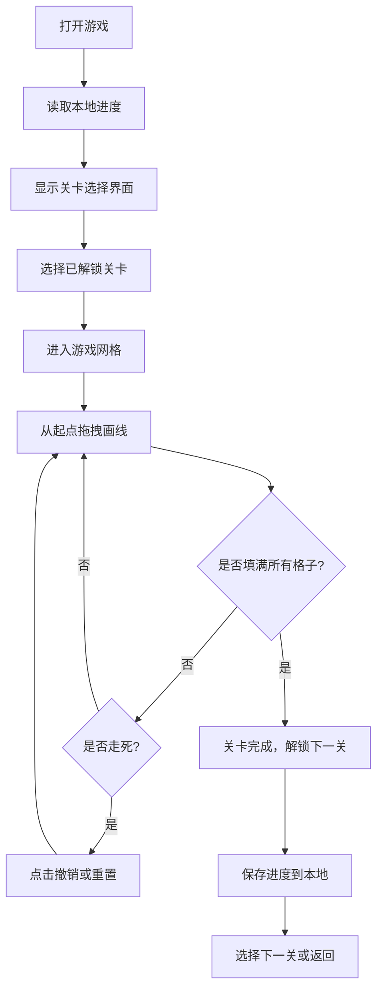

## 1. 产品概述

「一笔画填格子」是一款休闲益智类网页小游戏，玩家通过鼠标拖拽的方式从起点开始，一笔经过网格中所有格子且不能重复，考验玩家的空间思维和路径规划能力。

- 核心玩法：在方格网格中，从起点出发，上下左右移动，一笔填满所有格子
- 目标用户：喜欢休闲益智游戏的玩家，适合碎片时间放松
- 产品价值：提供简单有趣的益智体验，锻炼逻辑思维能力

## 2. 核心特性

### 2.1 用户角色

| 角色 | 注册方式 | 核心权限 |
|------|----------|----------|
| 普通玩家 | 无需注册 | 游玩关卡、保存进度、解锁新关卡 |

### 2.2 功能模块

1. **游戏主界面**：关卡选择、游戏网格、操作按钮
2. **关卡系统**：多个固定关卡，难度递增，解锁机制
3. **游戏交互**：鼠标拖拽画线、撤销、重置
4. **进度存储**：本地存储解锁进度和关卡状态

### 2.3 页面详情

| 页面名称 | 模块名称 | 功能描述 |
|----------|----------|----------|
| 游戏主页面 | 关卡选择区 | 展示所有关卡，已解锁/未解锁状态，当前关卡高亮 |
| 游戏主页面 | 游戏网格区 | 显示当前关卡的网格、起点、已走过的路径 |
| 游戏主页面 | 操作按钮区 | 撤销按钮、重置按钮 |
| 游戏主页面 | 关卡信息区 | 显示当前关卡编号、网格大小、通关提示 |

## 3. 核心流程

玩家打开游戏 → 选择已解锁关卡 → 进入游戏 → 从起点按住鼠标拖拽画线 → 经过所有格子完成关卡 → 解锁下一关 → 继续挑战或返回选择其他关卡

## 4. 用户界面设计

### 4.1 设计风格

- **主色调**：清新柔和的蓝绿色系 (#4ECDC4 为主色，#45B7D1 为辅助色)
- **背景色**：浅灰色渐变背景，营造清爽舒适的视觉体验
- **格子样式**：圆角矩形，轻微阴影，选中/走过状态有明显的颜色过渡
- **按钮样式**：圆角胶囊形状，悬停有缩放和颜色变化效果
- **字体**：使用现代无衬线字体，标题简洁有力，正文清晰易读
- **整体风格**：极简主义，留白充足，视觉层次分明，避免多余装饰

### 4.2 页面设计概述

| 页面名称 | 模块名称 | UI元素 |
|----------|----------|--------|
| 游戏主页面 | 关卡选择区 | 网格布局的关卡卡片，数字编号，锁图标，已完成标记，悬停动效 |
| 游戏主页面 | 游戏网格区 | 方格网格，起点标记（特殊颜色和图标），路径连线，填充动画 |
| 游戏主页面 | 操作按钮区 | 撤销按钮（带箭头图标）、重置按钮（带刷新图标），禁用状态样式 |
| 游戏主页面 | 通关弹窗 | 半透明遮罩，祝贺文字，下一关按钮，返回选择按钮，缩放入场动画 |

### 4.3 响应式

- 桌面端优先设计，主游戏区域居中显示
- 网格大小根据屏幕自适应，保证在不同分辨率下都有良好体验
- 按钮尺寸适合鼠标点击，有足够的热区

### 4.4 动画效果

- **画线动画**：路径填充时有平滑的颜色过渡动画，线条绘制有轨迹感
- **格子状态变化**：从当前格子移动到下一个格子时有缩放和颜色渐变效果
- **按钮交互**：悬停时轻微放大，点击时有按压反馈
- **通关动画**：所有格子依次闪烁高亮，然后弹出通关提示
- **页面切换**：关卡选择和游戏界面之间有淡入淡出过渡
