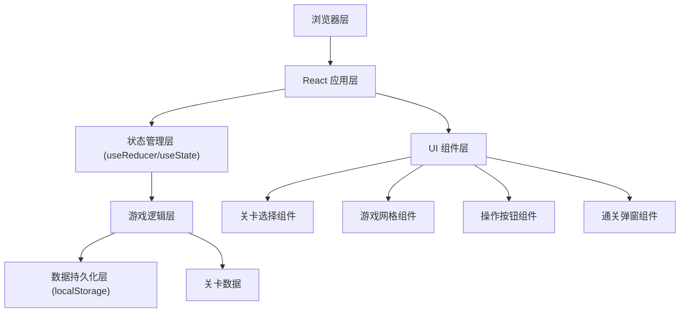

## 1. 架构设计



## 2. 技术选型

- **前端框架**：React@18 + TypeScript
- **构建工具**：Vite@5
- **样式方案**：TailwindCSS@3
- **状态管理**：React Hooks (useState, useReducer, useCallback)
- **数据存储**：localStorage（本地存储游戏进度）
- **动画方案**：CSS Transitions + CSS Animations + framer-motion

## 3. 目录结构

```
src/
├── components/
│   ├── LevelSelect.tsx      # 关卡选择组件
│   ├── GameGrid.tsx         # 游戏网格组件
│   ├── GameCell.tsx         # 单个格子组件
│   ├── ControlPanel.tsx     # 控制面板（撤销/重置按钮）
│   └── CompletionModal.tsx  # 通关弹窗组件
├── hooks/
│   ├── useGameLogic.ts      # 游戏核心逻辑 Hook
│   └── useLocalStorage.ts   # 本地存储 Hook
├── data/
│   └── levels.ts            # 关卡配置数据
├── types/
│   └── game.ts              # TypeScript 类型定义
├── utils/
│   └── pathValidator.ts     # 路径验证工具函数
├── App.tsx                  # 主应用组件
├── main.tsx                 # 入口文件
└── index.css                # 全局样式
```

## 4. 核心数据类型定义

```typescript
// 格子坐标
interface Position {
  row: number;
  col: number;
}

// 关卡配置
interface Level {
  id: number;
  name: string;
  gridSize: number; // 网格大小，如 5 表示 5x5
  startPosition: Position; // 起点位置
}

// 游戏状态
type GameStatus = 'idle' | 'playing' | 'completed';

// 游戏状态
interface GameState {
  currentLevel: number;
  path: Position[]; // 已走过的路径
  isDrawing: boolean; // 是否正在拖拽画线
  gameStatus: GameStatus;
}

// 玩家进度
interface PlayerProgress {
  unlockedLevel: number; // 已解锁的最大关卡编号
  completedLevels: number[]; // 已完成的关卡列表
}
```

## 5. 核心逻辑说明

### 5.1 路径验证规则

1. 只能从起点开始
2. 每次只能移动到相邻的格子（上下左右）
3. 不能重复经过已走过的格子
4. 不能斜向移动

### 5.2 关卡设计

预设 8 个关卡，难度递增：

| 关卡编号 | 网格大小 | 起点位置 |
|----------|----------|----------|
| 1 | 3×3 | (0, 0) |
| 2 | 4×4 | (0, 0) |
| 3 | 4×4 | (1, 1) |
| 4 | 5×5 | (0, 0) |
| 5 | 5×5 | (2, 2) |
| 6 | 6×6 | (0, 0) |
| 7 | 6×6 | (2, 2) |
| 8 | 7×7 | (3, 3) |

### 5.3 本地存储键名

- `one-line-puzzle-progress`：存储玩家进度数据

## 6. 路由定义

| 路由 | 用途 |
|------|------|
| / | 游戏主页面，包含关卡选择和游戏界面 |

本项目为单页应用，使用组件状态管理视图切换，无需额外路由库。
